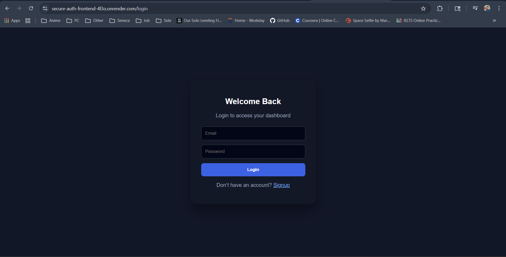
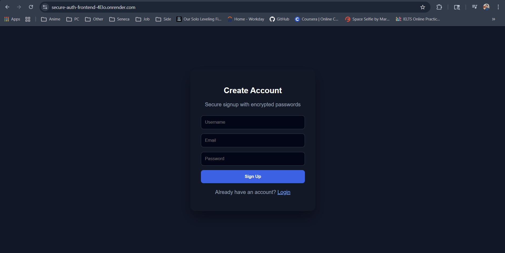
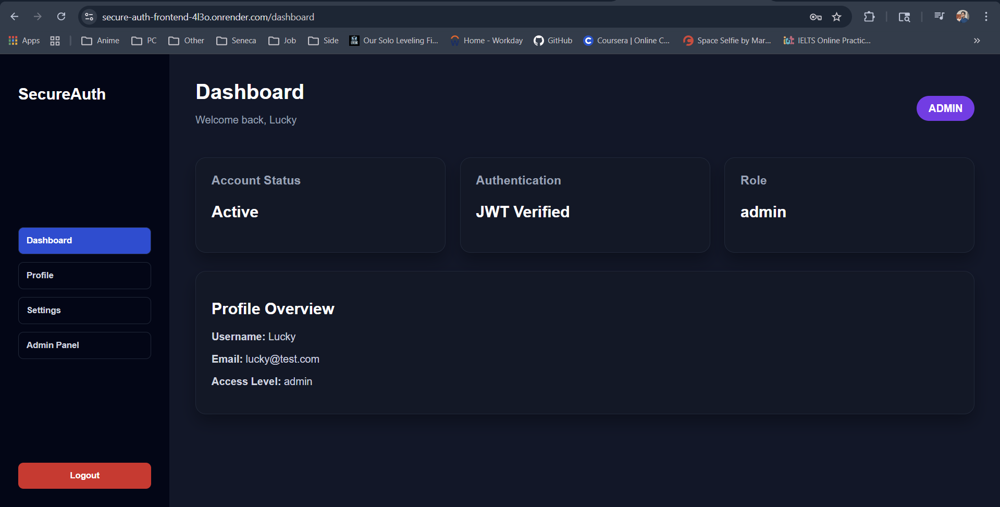
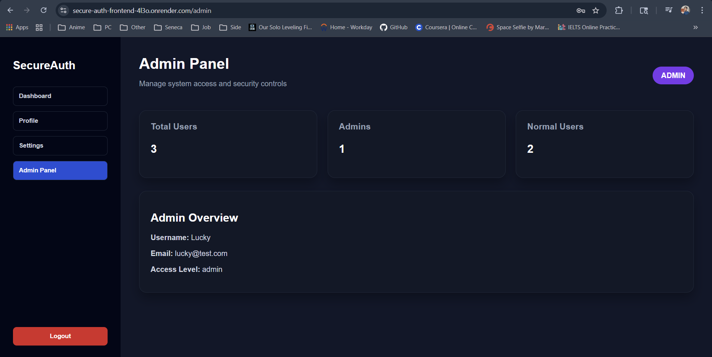

# Secure Login System

A full-stack secure login system with user authentication, role-based access (admin/user), and protected routes. Built with React (Vite) for the frontend and Node.js/Express/MongoDB for the backend.

---

## Live Demo: 
https://secure-auth-frontend-4l3o.onrender.com/

---

## Features

- **User Authentication:** Signup, login, JWT-based session management.
- **Role-Based Access:** Admin and user roles with protected admin routes.
- **Protected Routes:** Frontend and backend route protection.
- **User Dashboard:** Personalized dashboard for logged-in users.
- **Admin Panel:** Admin-only statistics and management.
- **Modern UI:** Built with React and React Router.

---

## Project Structure

```
Secure Login System/
│
├── client/      # React + Vite frontend
│   └── src/
│       ├── components/
│       └── pages/
│
└── server/      # Node.js + Express backend
		├── config/
		├── middleware/
		├── models/
		└── routes/
```

---

## Screenshots

| Login Page | Signup Page | Dashboard | Admin Panel |
|------------|------------|-----------|-------------|
|  |  |  |  |

---

## Getting Started

### Prerequisites

- Node.js & npm
- MongoDB

### 1. Clone the repository

```bash
git clone <repo-url>
cd "Secure Login System"
```

### 2. Setup the Server

```bash
cd server
npm install
# Create a .env file with:
# MONGO_URI=<your_mongo_connection_string>
# JWT_SECRET=<your_jwt_secret>
npm start
```

### 3. Setup the Client

```bash
cd ../client
npm install
# Create a .env file with:
# VITE_API_URL=http://localhost:5000
npm run dev
```

---

## Deployment

### Local Deployment

1. Start MongoDB locally or use a cloud provider (e.g., MongoDB Atlas).
2. Start the backend server (`npm start` in `server/`).
3. Start the frontend (`npm run dev` in `client/`).

### Production Deployment

- Host the backend (e.g., on Heroku, Render, or your VPS).
- Host the frontend (e.g., Vercel, Netlify, or your VPS).
- Set environment variables accordingly in both deployments.

---

## API Endpoints

### Auth Routes (`/api/auth`)

- `POST /signup` — Register a new user
	- Body: `{ username, email, password }`
- `POST /login` — Login user
	- Body: `{ email, password }`
- `POST /logout` — Logout user

### Protected Routes

- `GET /api/dashboard` — Get user dashboard (requires JWT in `Authorization` header)
- `GET /api/admin` — Get admin stats (requires JWT, admin role)

---

## Folder Details

- **client/src/pages/**: React pages (Login, Signup, Dashboard, Admin, etc.)
- **client/src/components/**: Shared React components (e.g., ProtectedRoute)
- **server/models/**: Mongoose models (User)
- **server/routes/**: Express routes (auth, protected, admin)
- **server/middleware/**: Auth and admin middleware

---

## Security

- Passwords hashed with bcrypt.
- JWT for authentication.
- Role-based access control.

---

## License

MIT
